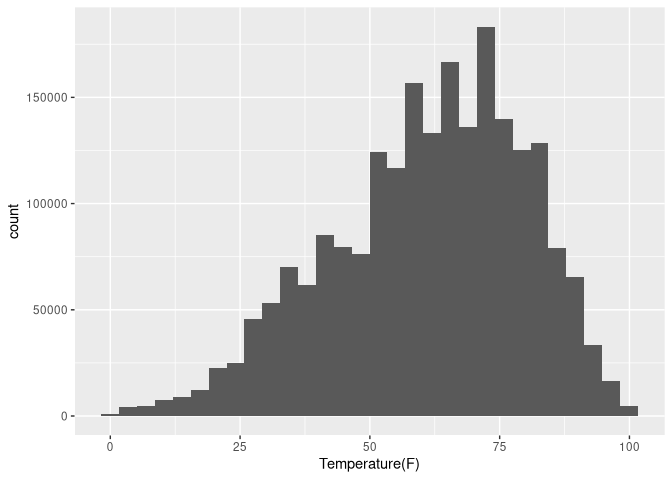

The following project is an Exploratory Data Analysis based on a data
set obtained from kaggle, [US
Accidents](https://www.kaggle.com/sobhanmoosavi/us-accidents), which was
intended to be my first kernel in Kaggle. For that reason I decided to
work the code on my personal computer and upload the updates to kaggle
every now and then. I have decided to keep a copy on github in order to
keep all my work of data processing together in one website. However,
the kaggle kernel that I created can be found
[here](https://www.kaggle.com/teoten/us-accidents-eda)

INTRODUCTION
============

With the following exploratory analysis we will see how much parameters
like humidity and traffic signals influence the accidents in the USA,
and why some others are not so decisive. We will explore how in
different states different parameters are more important than others,
and how different variables could help us to predict accidents.

We can get started, but first things first: calling the required
libraries and the data:

``` r
library(tidyverse)
library(cowplot)
library(lubridate)

#US_accidents <- read_csv('../input/us-accidents/US_Accidents_May19.csv')
load('eda.RData')
```

Now we can start with a general overview of the data, the `tibble`, and
a quick summary of the numeric variables using the basic R function
`summary`

``` r
## First view
US_accidents
```

    ## # A tibble: 2,243,939 x 49
    ##    ID    Source   TMC Severity Start_Time          End_Time           
    ##    <chr> <chr>  <dbl>    <dbl> <dttm>              <dttm>             
    ##  1 A-1   MapQu…   201        3 2016-02-08 05:46:00 2016-02-08 11:00:00
    ##  2 A-2   MapQu…   201        2 2016-02-08 06:07:59 2016-02-08 06:37:59
    ##  3 A-3   MapQu…   201        2 2016-02-08 06:49:27 2016-02-08 07:19:27
    ##  4 A-4   MapQu…   201        3 2016-02-08 07:23:34 2016-02-08 07:53:34
    ##  5 A-5   MapQu…   201        2 2016-02-08 07:39:07 2016-02-08 08:09:07
    ##  6 A-6   MapQu…   201        3 2016-02-08 07:44:26 2016-02-08 08:14:26
    ##  7 A-7   MapQu…   201        2 2016-02-08 07:59:35 2016-02-08 08:29:35
    ##  8 A-8   MapQu…   201        3 2016-02-08 07:59:58 2016-02-08 08:29:58
    ##  9 A-9   MapQu…   201        2 2016-02-08 08:00:40 2016-02-08 08:30:40
    ## 10 A-10  MapQu…   201        3 2016-02-08 08:10:04 2016-02-08 08:40:04
    ## # … with 2,243,929 more rows, and 43 more variables: Start_Lat <dbl>,
    ## #   Start_Lng <dbl>, End_Lat <lgl>, End_Lng <lgl>, `Distance(mi)` <dbl>,
    ## #   Description <chr>, Number <dbl>, Street <chr>, Side <chr>, City <chr>,
    ## #   County <chr>, State <chr>, Zipcode <chr>, Country <chr>,
    ## #   Timezone <chr>, Airport_Code <chr>, Weather_Timestamp <dttm>,
    ## #   `Temperature(F)` <dbl>, `Wind_Chill(F)` <dbl>, `Humidity(%)` <dbl>,
    ## #   `Pressure(in)` <dbl>, `Visibility(mi)` <dbl>, Wind_Direction <chr>,
    ## #   `Wind_Speed(mph)` <dbl>, `Precipitation(in)` <dbl>,
    ## #   Weather_Condition <chr>, Amenity <lgl>, Bump <lgl>, Crossing <lgl>,
    ## #   Give_Way <lgl>, Junction <lgl>, No_Exit <lgl>, Railway <lgl>,
    ## #   Roundabout <lgl>, Station <lgl>, Stop <lgl>, Traffic_Calming <lgl>,
    ## #   Traffic_Signal <lgl>, Turning_Loop <lgl>, Sunrise_Sunset <chr>,
    ## #   Civil_Twilight <chr>, Nautical_Twilight <chr>,
    ## #   Astronomical_Twilight <chr>

``` r
## Numeric vars
US_accidents %>%
    select(Severity,
           `Distance(mi)`,
           `Temperature(F)`,
           `Wind_Chill(F)`,
           `Humidity(%)`,
           `Pressure(in)`,
           `Visibility(mi)`,
           `Wind_Speed(mph)`,
           `Precipitation(in)`) %>%
    summary()
```

    ##     Severity      Distance(mi)      Temperature(F)   Wind_Chill(F)    
    ##  Min.   :0.000   Min.   :  0.0000   Min.   :-77.80   Min.   :-65.9    
    ##  1st Qu.:2.000   1st Qu.:  0.0000   1st Qu.: 48.90   1st Qu.: 19.2    
    ##  Median :2.000   Median :  0.0000   Median : 63.00   Median : 28.7    
    ##  Mean   :2.383   Mean   :  0.2879   Mean   : 61.23   Mean   : 26.0    
    ##  3rd Qu.:3.000   3rd Qu.:  0.0100   3rd Qu.: 75.90   3rd Qu.: 36.4    
    ##  Max.   :4.000   Max.   :333.6300   Max.   :170.60   Max.   : 45.2    
    ##                                     NA's   :62265    NA's   :1852370  
    ##   Humidity(%)      Pressure(in)   Visibility(mi)   Wind_Speed(mph) 
    ##  Min.   :  4.00   Min.   : 0.00   Min.   :  0.00   Min.   :  1.2   
    ##  1st Qu.: 50.00   1st Qu.:29.92   1st Qu.: 10.00   1st Qu.:  5.8   
    ##  Median : 68.00   Median :30.03   Median : 10.00   Median :  8.1   
    ##  Mean   : 65.93   Mean   :30.04   Mean   :  9.12   Mean   :  8.8   
    ##  3rd Qu.: 85.00   3rd Qu.:30.15   3rd Qu.: 10.00   3rd Qu.: 11.5   
    ##  Max.   :100.00   Max.   :33.04   Max.   :140.00   Max.   :822.8   
    ##  NA's   :64467    NA's   :57280   NA's   :71360    NA's   :442954  
    ##  Precipitation(in)
    ##  Min.   : 0.0     
    ##  1st Qu.: 0.0     
    ##  Median : 0.0     
    ##  Mean   : 0.1     
    ##  3rd Qu.: 0.0     
    ##  Max.   :10.8     
    ##  NA's   :1979466

By default, calling the data as a tibble gives us already valuable
information on the data set. Using `summary` on selected variables
returns a first description of our data, and the first impressions about
the accidents:

-   There are extreme temperatures, from -77 to 170 F
-   Wind chill also extreme to -65
-   Maximum wind speed reaches 822 mph
-   Humidity reaches 100 %
-   Precipitation, distance affected and visibility do not seem to be of
    big importance

We can go now to the Boolean variables:

``` r
## Boolean vars
US_accidents %>%
    select(Amenity:Turning_Loop) %>%
    summary()
```

    ##   Amenity           Bump          Crossing        Give_Way      
    ##  Mode :logical   Mode :logical   Mode :logical   Mode :logical  
    ##  FALSE:2217962   FALSE:2243700   FALSE:2122156   FALSE:2239215  
    ##  TRUE :25977     TRUE :239       TRUE :121783    TRUE :4724     
    ##   Junction        No_Exit         Railway        Roundabout     
    ##  Mode :logical   Mode :logical   Mode :logical   Mode :logical  
    ##  FALSE:2056574   FALSE:2241773   FALSE:2225741   FALSE:2243811  
    ##  TRUE :187365    TRUE :2166      TRUE :18198     TRUE :128      
    ##   Station           Stop         Traffic_Calming Traffic_Signal 
    ##  Mode :logical   Mode :logical   Mode :logical   Mode :logical  
    ##  FALSE:2207714   FALSE:2222168   FALSE:2243321   FALSE:1885291  
    ##  TRUE :36225     TRUE :21771     TRUE :618       TRUE :358648   
    ##  Turning_Loop   
    ##  Mode :logical  
    ##  FALSE:2243939  
    ## 

``` r
## Graphical representation
signals <- US_accidents %>%
    select(Amenity:Turning_Loop) %>%
    pivot_longer( cols = Amenity:Turning_Loop,
        names_to = 'Annotation',
        values_to = 'Trues') %>%
    filter(Trues == TRUE) %>%
    group_by(Annotation) %>%
    summarise(Total = n())

signals %>%
    ggplot() +
    geom_bar(aes(y = Total,
                 x = reorder(Annotation, Total, FUN = abs),
                 fill = Total),
             stat = 'identity') +
    coord_flip() +
    labs(x = NULL) +
    theme(legend.position="none")
```


We can also see that most of the accidents happen at traffic signals,
then junctions and crossing.

``` r
## Other variables
##
## API which reported accident
unique(US_accidents$Source)
```

    ## [1] "MapQuest"      "MapQuest-Bing" "Bing"

``` r
## Traffic message channel
unique(US_accidents$TMC)
```

    ##  [1] 201 241 247 246 341 406 245 248 200 244 203 229 222 202 206 343 236
    ## [18] 239 336 339 351  NA

``` r
## Severity: 1 is lesser, 4 is higher
unique(US_accidents$Severity)
```

    ## [1] 3 2 1 4 0

There are 3 sources of the data, 21 traffic message channels and 4
values of severity.

NUMERIC VARIABLES
=================

Now we are going deeper into the numeric variables that could possibly
have certain influence in the occurrence of accidents, due to their
extreme values. Therefore, we start by observing if the extreme values
(such as too cold or too hot weather) are a normal trend for the
accidents to happen, or they are rather atypical values.

``` r
## Temperature
US_accidents %>%
    ggplot() +
    geom_histogram(aes(x = `Temperature(F)`))
```


``` r
## Central view on the main trend
US_accidents %>%
    filter(`Temperature(F)` > 0 &
           `Temperature(F)` <= 100) %>%
    ggplot() +
    geom_histogram(aes(x = `Temperature(F)`))
```



``` r
## More specific view at the main values
US_accidents %>%
    filter(`Temperature(F)` > 45 &
           `Temperature(F)` <= 80) %>%
    ggplot() +
    geom_histogram(aes(x = `Temperature(F)`))
```


In the first plot we can immediately see that below 0 and above 100°F
there is practically nothing. Therefore we create a second plot centred
between this values. Here we can see that most of the accidents happen
between 45 and 80°F, with some particular peaks. Thus, we create a third
plot where we can see those peaks in more detail. There is a particular
trend of a considerable increase in the number of accidents marked by a
peak, and then a drop, follow by a slow increase, and then the same
trend. This could be caused most probably by the instruments of
measurement in the meteorological station, to certain extent.

``` r
## Wind chill
US_accidents %>%
    ggplot() +
    geom_histogram(aes(x = `Wind_Chill(F)`))
```


``` r
US_accidents %>%
    select(`Wind_Chill(F)`) %>%
    filter(`Wind_Chill(F)` < 30) %>%
    summarise(n())
```

    ## # A tibble: 1 x 1
    ##    `n()`
    ##    <int>
    ## 1 209936

There is an increase in the number of accidents with the increase of the
wind temperature, with the peak at 75°F. The number of accidents at
really cold temperatures (here I chose 30°F) is rather small compared
with the total accidents: 209,936 out of 2,243,939, or 9.35 percent

``` r
## Wind speed
US_accidents %>%
    ggplot() +
    geom_histogram(aes(x = `Wind_Speed(mph)`))
```


``` r
US_accidents %>%
    select(`Wind_Speed(mph)`) %>%
    filter(`Wind_Speed(mph)` < 25) %>%
    ggplot() +
    geom_histogram(aes(x = `Wind_Speed(mph)`))
```


Despite of the fact that maximum wind speed reaches 822.8 mph, we can
see in our first plot that most of the accidents happened at rather low
speed. More interesting: when we zoom into the values below 25 mph we
can see again a trend of gaps between certain values. This is clearly a
measurement issue. Thus, our theory about the temperature problems could
be certainly related to the measurement instruments.

``` r
## Humidity
US_accidents %>%
    ggplot() +
    geom_histogram(aes(x = `Humidity(%)`))
```


``` r
US_accidents %>%
    select(`Humidity(%)`) %>%
    filter(`Humidity(%)` > 35) %>%
    ggplot() +
    geom_histogram(aes(x = `Humidity(%)`))
```


Unlike our previous variables, we can see that the number of accidents
increases when the humidity increases.

STATES
======

Now we can explore a little bit the accidents in different states: which
state has the main occurrence of accidents? Which one the most severe
ones? Is there a relationship with the traffic lights or the humidity as
we discovered early?

We can start with the basic questions, amount of accidents per state and
severity:

``` r
## Amount of accidents per state
US_accidents %>%
    select(State) %>%
    group_by(State) %>%
    summarise(Total = n()) %>%
    ggplot() +
    geom_bar(aes(y = Total,
                 x = reorder(State, Total, FUN = abs),
                 fill = Total),
             stat = 'identity') +
    coord_flip() +
    labs(x = NULL) +
    theme(legend.position="none")
```


``` r
## Amount per state/severity, proportional
US_accidents %>%
    select(Severity, State) %>%
    mutate(State = parse_factor(State),
           Severity = parse_factor(as.character(Severity))) %>%
    group_by(State, Severity) %>%
    summarise(Total = n()) %>%
    ggplot() +
    geom_bar(aes(y = Total,
                 x = State,
                 fill = Severity),
             stat = 'identity',
             position = 'fill') +
    coord_flip() +
    scale_fill_brewer(palette = 'BuPu') +
    labs(x = NULL)
```


At first glance it is clear that most of the accidents were reported
from CA, then TX and FL. As for the severity, most of the records are
for severity levels 2 and 3. It can be interesting to see if the states
where most of the accidents happen are also correlated with the
severity. For this I have created a function to to plot each severity
value and filter values above a given number of observations. Using this
function we can later adapt each graphic for a better visualisation:

``` r
## Function
plot_SevState <- function(sev, min = 10000) {
    US_accidents %>%
        select(State, Severity) %>%
        filter(Severity == sev) %>%
        group_by(State) %>%
        summarise(Total = n()) %>%
        filter(Total > min) %>%
        ggplot() +
        geom_bar(aes(y = Total,
                     x = reorder(State, Total, FUN = abs),
                     fill = Total),
                 stat = 'identity') +
        coord_flip() +
        labs(x = NULL, y = paste("Severity", sev, "Total")) +
        theme(legend.position="none")
}

## Visualization
plot_grid(
    plot_SevState(1, min = 50),
    plot_SevState(2, min = 50000),
    plot_SevState(3),
    plot_SevState(4, min = 2000))
```


As expected, CA is in the first positions of the four plots, while TX
and FL are also around. When it comes to the accidents with severity
level 4, we see FL in the first position, followed by GA and CA. The
order vary, but the difference between each state is minimal compared
with the number of entries that we have.

We can also check the relationship between states and our most
influencial variables, such as humidity and traffict signals.

``` r
## Relationship with humidity
US_accidents %>%
    select(State, `Humidity(%)`, Severity) %>%
    filter(Severity != 0) %>%
    mutate(State = parse_factor(State),
           Severity = parse_factor(as.character(Severity))) %>%
    group_by(State, Severity) %>%
    summarise(Humidity = mean(`Humidity(%)`, na.rm = T)) %>%
    ggplot(aes(x = State, y = Humidity)) +
    geom_point(aes(colour = Severity, shape = Severity),
               size = 6) +
    scale_fill_brewer(palette = 'BuPu') +
    labs(y = 'Average humidity')
```


``` r
US_accidents %>%
    select(State, `Humidity(%)`, Severity) %>%
    filter(Severity != 0) %>%
    mutate(State = parse_factor(State),
           Severity = parse_factor(as.character(Severity))) %>%
    group_by(State, Severity) %>%
    summarise(Humidity = mean(`Humidity(%)`, na.rm = T)) %>%
    filter(Humidity > 70) %>%
    ggplot(aes(x = State, y = Humidity)) +
    geom_point(aes(colour = Severity, shape = Severity),
               size = 6) +
    scale_fill_brewer(palette = 'BuPu') +
    labs(y = 'Average humidity')
```


``` r
## States with main accidents at traffic signals
US_accidents %>%
    select(State, Traffic_Signal) %>%
    filter(Traffic_Signal == TRUE) %>%
    group_by(State) %>%
    summarise(Total = n()) %>%
    filter(Total > 5000) %>%
    ggplot() +
    geom_bar(aes(y = Total,
                 x = reorder(State, Total, FUN = abs),
                 fill = Total),
             stat = 'identity') +
    coord_flip() +
    labs(x = NULL, y = 'No. of accidents at traffic signals') +
    theme(legend.position="none")
```


Accidents of severity 1 happen at different ranges of humidity, from dry
conditions to very humid. However, most of the accidents happen at
average humidity percentage between 60 and 80. For accidents of level 4
there is and increase in the average humidity, happening between 70-77%
most of the times. At Hum \> 80% happen mostly accidents level 1. ND
state is a particular case, with level 4 accidents of average humidity
of 91%, CA and TX are not among the states with average humidity above
70%.

As for traffic signals, we have again our top states heading the others,
but in a different order. CA comes in third place, it could be that
traffic signal areas are not the mean place for accidents in CA.

``` r
## View at CA only
filter(US_accidents, State == "CA") %>%
    select(Amenity:Turning_Loop) %>%
    summary()
```

    ##   Amenity           Bump          Crossing        Give_Way      
    ##  Mode :logical   Mode :logical   Mode :logical   Mode :logical  
    ##  FALSE:481563    FALSE:484676    FALSE:475619    FALSE:484525   
    ##  TRUE :3143      TRUE :30        TRUE :9087      TRUE :181      
    ##   Junction        No_Exit         Railway        Roundabout     
    ##  Mode :logical   Mode :logical   Mode :logical   Mode :logical  
    ##  FALSE:420390    FALSE:484495    FALSE:479325    FALSE:484694   
    ##  TRUE :64316     TRUE :211       TRUE :5381      TRUE :12       
    ##   Station           Stop         Traffic_Calming Traffic_Signal 
    ##  Mode :logical   Mode :logical   Mode :logical   Mode :logical  
    ##  FALSE:476064    FALSE:478652    FALSE:484655    FALSE:453662   
    ##  TRUE :8642      TRUE :6054      TRUE :51        TRUE :31044    
    ##  Turning_Loop   
    ##  Mode :logical  
    ##  FALSE:484706   
    ## 

It looks like in CA, most of the accidents are reported at junctions
more than at traffic signals.

TIME
====

Now we are going to have a quick view on the occurrence of accidents in
time. The first idea and easiest option would be to look at the
occurrence of accidents in specific moments, say grouped by Month (to
represent time of the year) and by Hour (to obtain time of the day). For
this we can use the package `lubridate` which makes such work easier:

``` r
## Months
US_accidents %>%
    select(Start_Time) %>%
    transmute(Month = month(Start_Time,
                            label = T,
                            locale = 'en_US.utf8')) %>%
    ggplot(aes(x = Month)) +
    geom_bar()
```


``` r
## Month/Year
US_accidents %>%
    select(Start_Time) %>%
    transmute(Month = month(Start_Time,
                            label = T,
                            locale = 'en_US.utf8'),
              Year = year(Start_Time)) %>%
    filter(Year != 2015) %>% # only 7 accidents overall
    group_by(Year, Month) %>%
    summarise(`No of accidents` = n()) %>%
    ggplot(aes(x = Month, y = `No of accidents`)) +
    geom_bar(stat = 'identity') +
    facet_grid(~Year)  +
    theme(axis.text.x = element_text(angle = 90))
```


``` r
## Per hour
US_accidents %>%
    select(Start_Time) %>%
    transmute(Hour = hour(Start_Time)) %>%
    mutate(Hour = factor(as.character(Hour),
                         levels = as.character(c(0:23)))) %>%
    ggplot(aes(Hour)) +
    geom_histogram(stat = 'count')
```


The amount of accidents reduces between April and July, as well as
during night time. It seems that most of the accidents happen in the
morning, between 7-8 hrs, and at early evening, between 16-17 hrs. In
other view, less accidents are happening during the warmest months and
during the coldest hours. That might answer the question why we did not
find a trend in the occurrence of accidents related to Temperature or
Wind Chill, but Humidity, considering that humidity raises at dusk and
down, with the movements of the sun.

``` r
## Month and humidity
US_accidents %>%
    select(Start_Time, `Humidity(%)`) %>%
    mutate(Month = month(Start_Time,
                            label = T,
                         locale = 'en_US.utf8')) %>%
    group_by(Month) %>%
    summarise(Avg_Hum = mean(`Humidity(%)`, na.rm = T),
              Count = n()) %>%
    ggplot(aes(x = Month, y = Avg_Hum)) +
    geom_point(aes(size = Count))
```


``` r
## Hour and Humidity
US_accidents %>%
    select(Start_Time, `Humidity(%)`) %>%
    mutate(Hour = hour(Start_Time),
           Hour = factor(as.character(Hour),
                         levels = as.character(c(0:23)))) %>%
    group_by(Hour) %>%
    summarise(Avg_Hum = mean(`Humidity(%)`, na.rm = T),
              Count = n()) %>%
    ggplot(aes(x = Hour, y = Avg_Hum)) +
    geom_point(aes(size = Count))
```


As expected, we can easily observe the rise of the humidity at dusk and
down (moments of most accidents), and its reduction between March and
July (months with less accidents).
